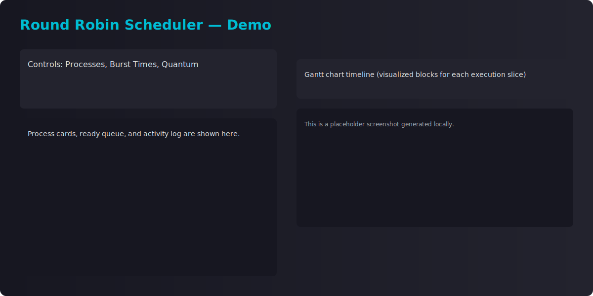

# Round Robin Scheduling Game

This repository contains a real-time Round Robin scheduler simulation (UI + visualization). The demo is included as `index.html` and can be opened locally in a browser or served via GitHub Pages.

Files
- `index.html` — Demo HTML (full UI) linked to `styles.css` for styling.
- `styles.css` — Extracted stylesheet (clean, reusable)
- `original_RR.html` — Backup of the original file you provided (kept for reference).
- `LICENSE` — MIT license
- `assets/screenshot.svg` — small placeholder screenshot used in this README

Quick start (local)
1. Open `index.html` in your browser (double-click or drag into the browser).
2. Adjust the number of processes, burst times, and time quantum in the control panel, then click "RUN SIMULATION".

GitHub Pages
- This repository includes a GitHub Actions workflow that will publish the `index.html` to GitHub Pages automatically on push to `main`. After the first successful run, your site will be available at:

	https://<your-github-username>.github.io/Round-Robin-Scheduling-Game-

	Replace `<your-github-username>` with `Mahfuj-Barbhuiya` (your repo owner). It may take a minute for pages to become active after the first deployment.

Notes
- The original provided file was named `RR.css` but contained a full HTML document; I split styles into `styles.css` and replaced the demo `index.html` with a full UI linked to that stylesheet.
- `original_RR.html` contains a backup of the original content.

Screenshot

License
MIT — feel free to modify and reuse.

If you'd like, I can:
- Replace the placeholder screenshot with a generated GIF or a real screenshot.
- Tweak the UI, split JS into a separate file, or add tests.
- Enable a custom domain for GitHub Pages.

